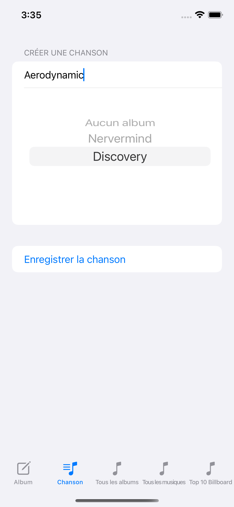

# OBERT Yannis: Rendu Architecture Mobile - IOS

## Description

This application allows you to save your favorite albums and music.

We also find a page on which we have the Billboard top 10 thanks to an API.

## Project Architecture
```
📦ProjectA4
 ┣ 📂.ProjectA4
 ┃ ┗ 📂Assets.xcassets
 ┃ ┗ 📂Manager
 ┃ ┃ ┗ 📜AlbumManager.swift
 ┃ ┃ ┗ 📜SharedDataManager.swift
 ┃ ┃ ┗ 📜SongManager.swift
 ┃ ┗ 📂Model
 ┃ ┃ ┗ 📜Album.swift
 ┃ ┃ ┗ 📜Song.swift
 ┃ ┃ ┗ 📜TopSong.swift
 ┃ ┃ ┗ 📜Artist.swift
 ┃ ┗ 📂PreviewContent/Preview Assets.xcassets
 ┃ ┗ 📂View
 ┃   ┗ 📜AlbumCreationView.swift
 ┃   ┗ 📜AlbumListView.swift
 ┃   ┗ 📜EditAlbumView.swift
 ┃   ┗ 📜EditSongView.swift
 ┃   ┗ 📜SongCreationView.swift
 ┃   ┗ 📜SontListView.swift
 ┃   ┗ 📜Top10BillboardView.swift
 ┣ 📂.ProjectA4.xcodeproj
 ┗ 📜README.md
```


## Entities

We find a total of four entities with a total of 2 relationships:
- First relationship: several songs (Song) can be linked to an album.
- Second relationship: a top music (TopSong) can be linked to an artist.

### 1. Album 

- id 
- name
- band
- image
- creationDate

### 2. Song

- id 
- name
- albumId (optional)(relation)

### 3. TopSong

- title
- artist (relation)

### 4. Artist

- name

## Pages

At the bottom of our page we always find a menu to access the different pages.

### 1. List albums (& edit/remove)
List all albums.

Button next to each album to be able to delete them.

Button next to each album to be able to edit it, this opens a window above which allows you to modify the fields (WARNING: it is absolutely necessary that the name of the album and the name of the group are not empty).


### 2. List songs (& edit/remove)
List all music.

Button next to each music to be able to delete them.

Button next to each music to be able to edit it, this opens a window above which allows you to modify the fields (WARNING: it is absolutely necessary that the name of the music is not empty).


### 3. Creation album

To create an album we have several fields, one to add a name, a second to put the name of the group, a third to put the URL of an image and a last one to add the release date.


### 4. Creation song

To create music we find a TextField to insert the name of music and a Picker which allows you to choose an already recorded album.



### 5. Top 10 Billboard (API)

Thanks to the Deezer API we find the Billboard top 10 on this page.


## Collaborator
- [OBERT Yannis](https://github.com/yannisobert)