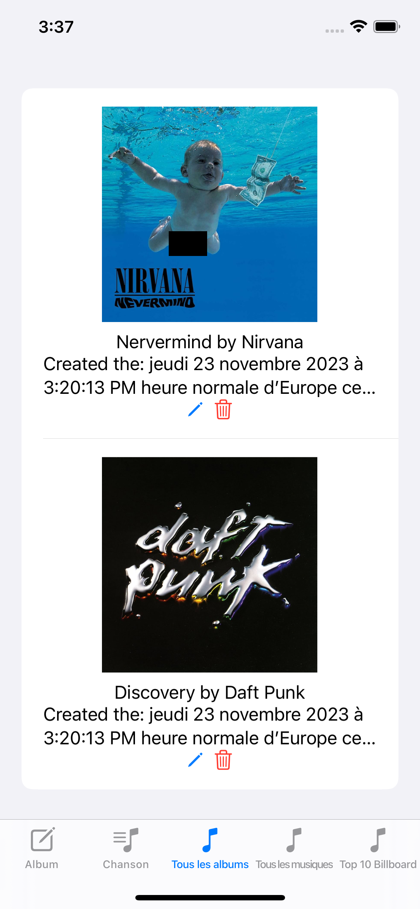

# OBERT Yannis: Rendu Architecture Mobile - IOS

## Description

Cette application permet d'enregistrer ses albums et ses musiques préférés.

Nous retrouvons également une page sur laquelle nous avons le top 10 Billboard grâce à une API.

## Project Architecture
```
📦ProjectA4
 ┣ 📂.ProjectA4
 ┃ ┗ 📂Assets.xcassets
 ┃ ┗ 📂Manager
 ┃ ┃ ┗ 📜AlbumManager.swift
 ┃ ┃ ┗ 📜SharedDataManager.swift
 ┃ ┃ ┗ 📜SongManager.swift
 ┃ ┗ 📂Model
 ┃ ┃ ┗ 📜Album.swift
 ┃ ┃ ┗ 📜Song.swift
 ┃ ┃ ┗ 📜TopSong.swift
 ┃ ┃ ┗ 📜Artist.swift
 ┃ ┗ 📂PreviewContent/Preview Assets.xcassets
 ┃ ┗ 📂View
 ┃   ┗ 📜AlbumCreationView.swift
 ┃   ┗ 📜AlbumListView.swift
 ┃   ┗ 📜EditAlbumView.swift
 ┃   ┗ 📜EditSongView.swift
 ┃   ┗ 📜SongCreationView.swift
 ┃   ┗ 📜SontListView.swift
 ┃   ┗ 📜Top10BillboardView.swift
 ┣ 📂.ProjectA4.xcodeproj
 ┗ 📜README.md
```


## Entities

Nous retrouvons en tout quatre entitées avec en tout 2 relations
- Première relation : plusieurs musiques (Song) peuvent être relié à un album.
- Seconde relation : une top musique (TopSong) peut être relié à un artist.

### 1. Album 

- id 
- name
- band
- image
- creationDate

### 2. Song

- id 
- name
- albumId (optional)(relation)

### 3. TopSong

- title
- artist (relation)

### 4. Artist

- name

## Pages

En bas de notre nous retrouvons toujours un menu pour pouvoir accéder aux différentes pages.

### 1. List albums (& edit/remove)
Liste tous les albums.

Bouton à côté de chaque album pour pouvoir les supprimer

Bouton à côté de chaque album pour pouvoir l'éditer, cela ouvre une fenêtre par dessus qui permet de modifier les champs (WARNING: il faut absolument que le nom de l'album et le nom du groupe ne soient pas vide)



### 2. List songs (& edit/remove)
List toutes les musiques

Bouton à côté de chaque musique pour pouvoir les supprimer

Bouton à côté de chaque musique pour pouvoir l'éditer, cela ouvre une fenêtre par dessus qui permet de modifier les champs (WARNING: il faut absolument que le nom de la musique ne soit pas vide)


### 3. Creation album

Pour créer un album nous plusieurs champs, un pour ajouter un nom, un second pour mettre le nom du groupe, un troisième pour mettre l'URL d'une image et un dernier pour ajouter la date de sortie.


### 4. Creation song

Pour créer une musique nous retrouvons un TextField pour insérer le nom d'une musique et un Picker qui permet de choisir un album déjà enregistré.


### 5. Top 10 Billboard (API)

Grâce à l'API de Deezer nous retrouvons sur cette page le top 10 Billboard.


## Collaborator
- [OBERT Yannis](https://github.com/yannisobert)